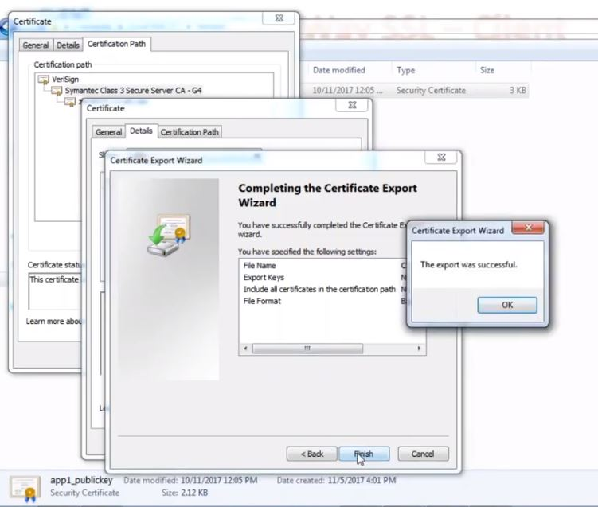

## SSL demo with pkcs12 and jks

- URL of this api - https://localhost/ssl/test/secured

SSL enabled Hello world programme using PKCS12 and JKS types key stores

#### Concepts taken from -> https://howtodoinjava.com/spring-boot/spring-boot-ssl-https-example/

#### Command to generate JKS key pair -
  keytool -genkey -alias selfsigned_keypair -keyalg RSA -keysize 2048 -validity 700 -keypass 123456 -storepass 123456 -keystore ssl-server.jks -dname "CN=localhost,OU=QE,O=example.com,L=Brno,C=CZ" -storepass 123456 -keypass 123456

## Another solution from https://www.drissamri.be/blog/java/enable-https-in-spring-boot/

#### Generate PKCS12 format key pair - 
  keytool -genkeypair -alias selfsigned_keypair -keyalg RSA -keysize 2048 -storetype PKCS12 -keystore ssl-server.p12 -validity 3650 -dname "CN=localhost,OU=QE,O=example.com,L=Brno,C=CZ" -storepass 123456 -keypass 123456
#### export jks file to PKCS12  format -
   keytool -importkeystore -srckeystore ssl-server.jks -destkeystore ssl-server-from-jks.p12 -deststoretype PKCS12 -srcstorepass 123456 -deststorepass 123456
   `n this case be careful 'alias' should remain same.

#### see jks content - keytool -list -v ssl-server.jks

#### export certificate from jks and add to cert file - 
  keytool -export -keystore ssl-server.jks -alias selfsigned_keypair -file ssl-server.cert
  If possible the cer file can be downloaded from chrome also. While downloading you can provide any password on prompt.

#### This certificate can be added to jre's certifacate file also instead of setting it in java code after changing to jts.
  
#### Print certificate content - 
  keytool -printcert -v -file ssl-server.crt (It is same as list -v')
#### export certificate from PKCS12 and add to cert file - 
  keytool -export -file ssl-server.cert -alias selfsigned_keypair -keystore ssl-server.p12 -deststoretype PKCS12
#### add certificate from cert file to truststore -
  keytool -import -file ssl-server.cert -alias selfsigned_keypair -keystore ssl-server.jts

#### Notes
- JKS (java key store) - A keystore is a repository of security certificates used in SSL encryption
- Truststore contains public key and certificate. It is shared with client.
- Key Store contains public key, private key and certificate so it can not be shared with client or anyone. 
- Above .jks file contains - public key, private key and certificate

- In java public directory all the trust store file are saved.

## https://developer.jboss.org/wiki/KeystoreFormatsJKSAndPEMCheatsheet for key format change
- convert keystore pkcs12 to PEM
  `openssl pkcs12 -in ssl-server.p12 -out ssl-server.pem`
  
- just private key
  `openssl pkcs12 -in ssl-server.p12 -out ssl-server-privkey.pem -nocerts -nodes` (-nodes is for -no DES. It is to avoide PEM pass phrase)
  
- pem file with just certificate
  `openssl pkcs12 -in ssl-server.p12 -out ssl-server-cert.pem -clcerts -nokeys`

## Similar solution from -> https://www.youtube.com/watch?v=vYhY11p47rI (It contains step to generate CA signing request also)
- Trust Store `Holds Certified Public Keys of other applications`
- Key Store `Holds Private and Certified Public Key of own application`

- Generate CA signing request `keytool -certreq -keyalg -RSA -alias selfsigned_keypair -file certreq.txt -keystore ssl-server.jks`

